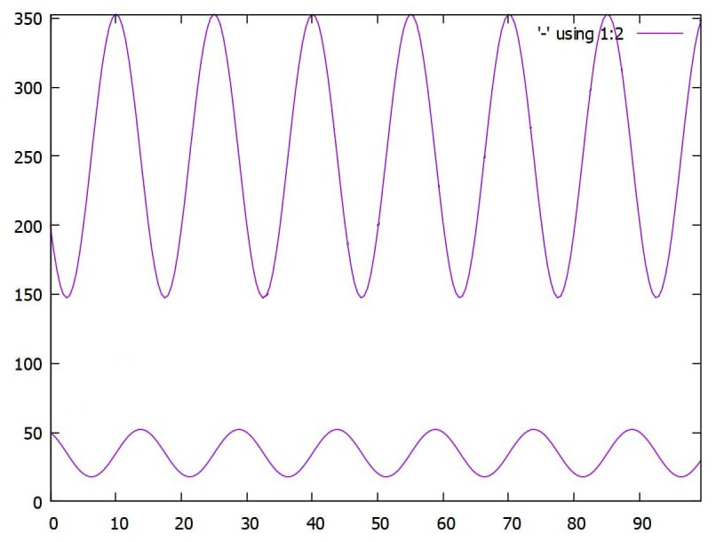
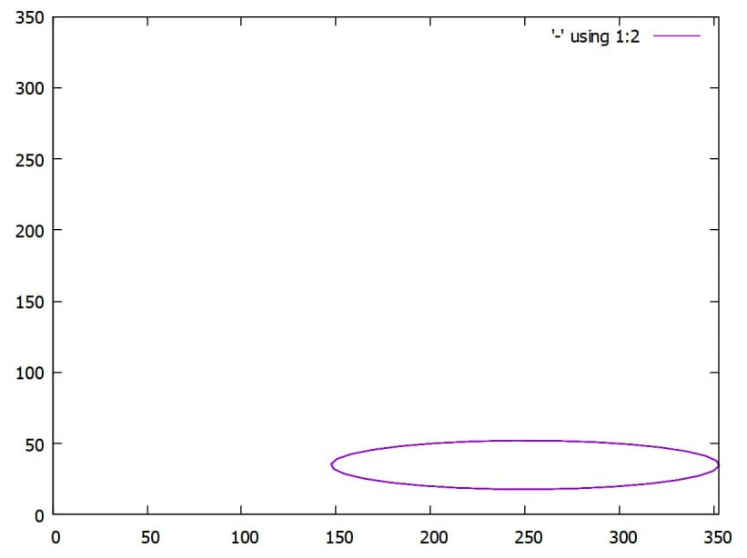
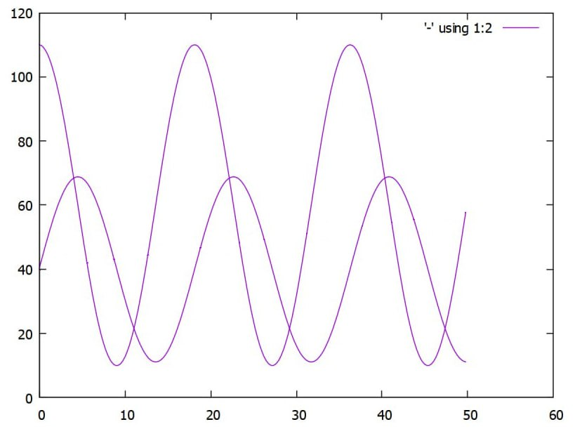
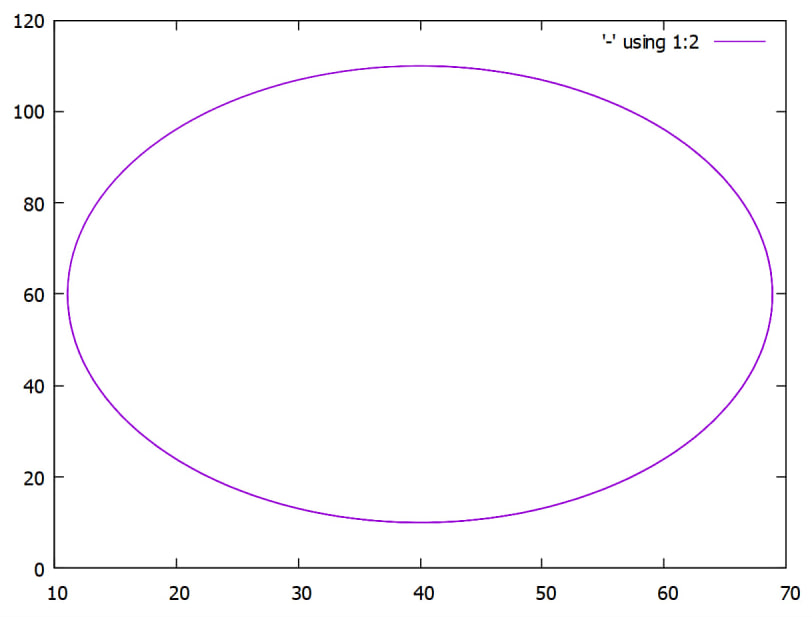
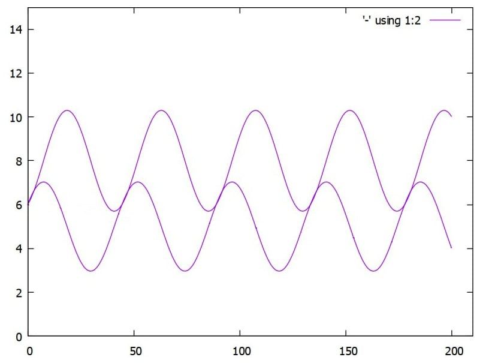
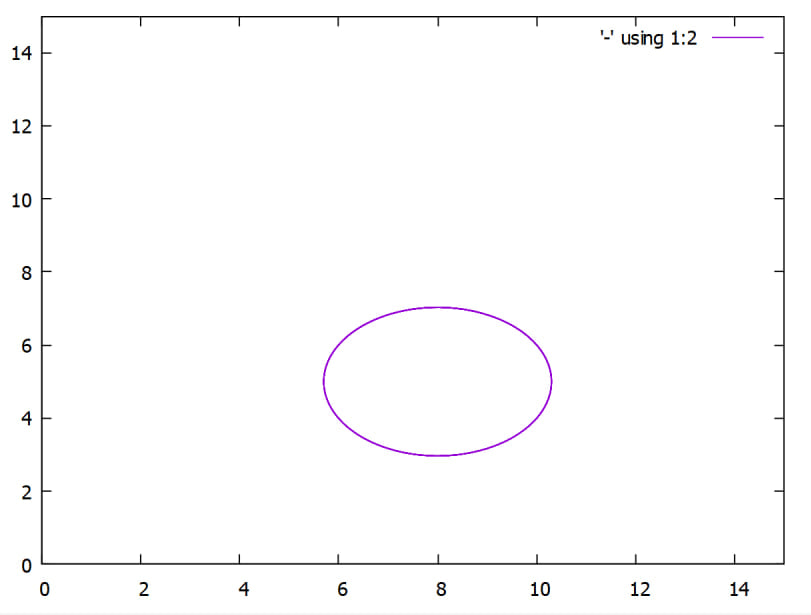

# Predator-Prey Model
C++ program that implements predator-prey model:

Let's simulate that 200 white hares and 50 red foxes were brought to a desert island:

The fertility rate of hares is α<sub>1</sub> = 0.35

The hare mortality rate is β<sub>1</sub> = 0.01

α<sub>2</sub> = 0.5

β<sub>2</sub> = 0.002 Correspondingly.

We will observe them for 100 days at half-day intervals.

So the input to the program will be:
```
200
50
0.35
0.01
0.5
0.002
100
200
```

Graph showing the change in the population of hares and foxes over time:





Graph of v(k):



Test Input:
```
110
40
0.4
0.01
0.3
0.005
50
200
``` 

Obtained image generated by GNUPlot of v(t) & k(t):



Graph of v(k):



Second Input:
```
6
6
0.2
0.025
0.1
0.02
200
1000
``` 

v(t) & k(t):



v(k):

